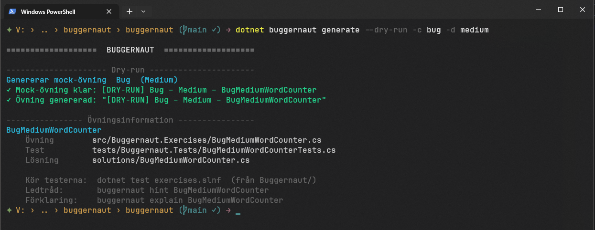
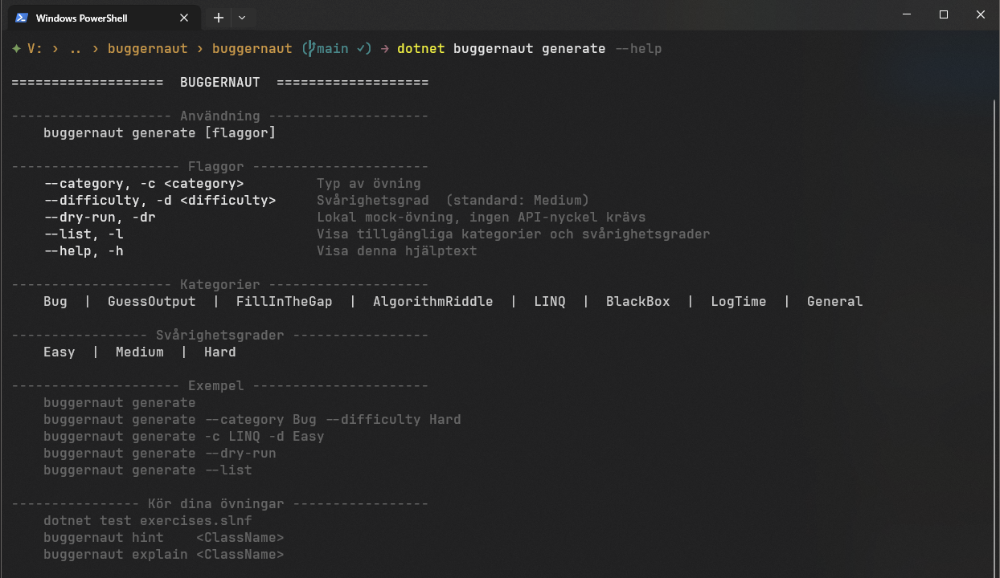

# Buggernaut

[](https://dotnet.microsoft.com/download) 
[](https://learn.microsoft.com/dotnet/csharp/) 
[](#vad-är-det-här) 
[](CONTRIBUTING.md) 
[](https://www.nuget.org/packages/Buggernaut) 
[](LICENSE.md)

> ##### Link to the English README file: [README-en.md](README-en.md)

Buggernaut är ett CLI-verktyg som genererar C#-övningar med inbyggda buggar via en LLM-provider du själv väljer.
Tanken är enkel: öppna en fil, hitta buggen, kör testerna, bli bättre på programmering.

Programmet är designat att ge juniora utvecklare chansen att träna på att hitta och fixa buggar i kod, samt förbättra sin
förståelse för programmeringskoncept utan att behöva lämna sin egen utvecklingsmiljö.


> Inspirerat av [ThePrimeagens Kata-Machine](https://github.com/ThePrimeagen/kata-machine).
> Tack till [Marcus Löf](https://github.com/LeafMaster1) för idéer och bollplank.

---
<a id="vad-ar-det-har"></a>
## Vad är det här?

Du kör ett kommando. Buggernaut frågar en AI om en C#-övning, skriver ut en `.cs`-fil med en
medveten bugg och en tillhörande testfil. Din uppgift är att hitta och fixa buggen tills testerna blir gröna.

Inga webbläsarflikar. Ingen registrering. Allt händer i din editor!

### Snabb demo


---

## Innehåll
- [Förutsättningar](#förutsättningar)
- [Snabbstart](#snabbstart)
- [Daglig användning](#daglig-användning)
- [Konfiguration](#konfiguration)
- [Köra tester](#köra-tester)
- [Vanliga problem](#vanliga-problem)
- [Vill du bidra?](#vill-du-bidra)
- [Kontakt](#kontakt)

---

## Förutsättningar

- [.NET 10 SDK](https://dotnet.microsoft.com/download)
- En API-nyckel till valfri provider (t.ex. `Gemini`, `OpenAI`, `Anthropic`, `Mistral`)

> `Ollama` fungerar utan API-nyckel, men kräver en lokal server.

Vill du testa utan API-nyckel först? Kör med `--dry-run`, det funkar direkt.



---

## Snabbstart

Alla kommandon körs från `Buggernaut/` om inget annat står.

### 1) Installera verktyget

```bash
cd Buggernaut
dotnet tool restore
```

### 2) Spara API-nyckel (engångsinställning)

Kör i `tools/Buggernaut.Generator/`:

```bash
cd tools/Buggernaut.Generator
dotnet user-secrets set "LLM:Gemini:ApiKey" "din-nyckel"
```

Nyckeln lagras lokalt på din dator och committas aldrig till Git.

Har du en nyckel till en annan leverantör? Byt bara ut `Gemini`:

```bash
dotnet user-secrets set "LLM:OpenAI:ApiKey"    "din-nyckel"
dotnet user-secrets set "LLM:Anthropic:ApiKey" "din-nyckel"
dotnet user-secrets set "LLM:Mistral:ApiKey"   "din-nyckel"
```

Problem att hitta API-nyckeln till din leverantör? Kolla här:

- **Gemini**: <https://aistudio.google.com/app/apikey>
- **OpenAI**: <https://platform.openai.com/api-keys>
- **Anthropic**: <https://console.anthropic.com/settings/keys>
- **Mistral**: <https://console.mistral.ai/>

### 3) Generera din första övning

```bash
cd Buggernaut
dotnet buggernaut generate
```

En ny `.cs`-fil dyker upp i `src/Buggernaut.Exercises/`.  
Öppna den, hitta buggen, fixa den.


---

## Daglig användning

```bash
dotnet buggernaut generate                         # generera ny övning
dotnet buggernaut generate -c LINQ -d Hard         # välj kategori och svårighetsgrad
dotnet buggernaut generate --dry-run               # testa utan API-nyckel

dotnet test exercises.slnf                         # kör dina övningstester

dotnet buggernaut hint    <ClassName>              # ledtråd när du kört fast
dotnet buggernaut explain <ClassName>              # förklaring när testerna är gröna
```

> **Tips:** Se alla flaggor och kategorier med:
> 
>```bash
> dotnet buggernaut generate --help
> ```



---

## Konfiguration
### Byta LLM-leverantör
Öppna `tools/Buggernaut.Generator/appsettings.json` och ändra `"Provider"`:

```json
{
  "LLM": {
    "Provider": "Gemini"
  }
}
```

Tillgängliga providers: `Gemini`, `OpenAI`, `Anthropic`, `Mistral`, `Ollama`. 
> Saknar du en leverantör? [Skicka in förslag](https://github.com/discovicke/buggernaut/issues) till mig så löser vi det! :)

Vill du köra lokalt utan internet? Sätt upp [Ollama](https://ollama.com) och byt till:

```json
{
  "LLM": {
    "Provider": "Ollama",
    "Ollama": {
      "BaseUrl": "http://localhost:11434/v1",
      "Model": "llama3"
    }
  }
}
```
#### Valfritt: sätt modell per leverantör:

```json
{
  "LLM": {
    "Provider": "Gemini",
    "Gemini": {
      "Model": "gemini-2.5-flash"
    },
    "OpenAI": {
      "Model": "gpt-4o-mini"
    },
    "Anthropic": {
      "Model": "claude-3-5-haiku-latest"
    },
    "Mistral": {
      "Model": "mistral-small"
    },
    "Ollama": {
      "BaseUrl": "http://localhost:11434/v1",
      "Model": "llama3"
    }
  }
}
```

---

## Köra tester

| Kommando                     | Vad som körs                            |
|------------------------------|-----------------------------------------|
| `dotnet test exercises.slnf` | Dina övningstester (`Buggernaut.Tests`) |
| `dotnet test generator.slnf` | Generatorns egna enhetstester           |
| `dotnet test`                | Alla tester                             |

---

## Vanliga problem

**`dotnet buggernaut` hittas inte**

- Kör `dotnet tool restore` i `Buggernaut/`.

**API-nyckel hittas inte**

- Kontrollera att `user-secrets` sattes i `tools/Buggernaut.Generator/`.

**Fel provider eller modell används**

- Kontrollera `tools/Buggernaut.Generator/appsettings.json`.

---

## Vill du bidra?

Kul! Läs [CONTRIBUTING.md](CONTRIBUTING.md) för riktlinjer kring brancher, commits och pull requests. Ingen press eller stress, vi lär oss tillsammans.

## Kontakt
Vill du nå mig så finns mina kontaktuppgifter på [GitHub](https://github.com/discovicke), eller så slänger du iväg ett [mail](mailto:johanssonviktor@pm.me)!